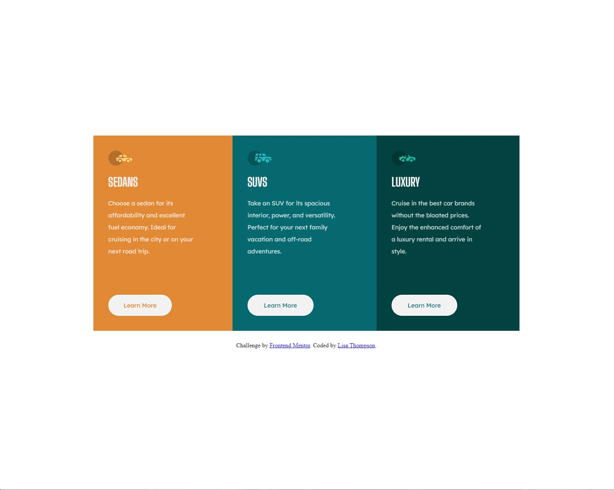

# Frontend Mentor - 3-column preview card component solution

This is a solution to the [3-column preview card component challenge on Frontend Mentor](https://www.frontendmentor.io/challenges/3column-preview-card-component-pH92eAR2-). Frontend Mentor challenges help you improve your coding skills by building realistic projects. 

## Table of contents

- [Overview](#overview)
  - [The challenge](#the-challenge)
  - [Screenshot](#screenshot)
  - [Links](#links)
- [My process](#my-process)
  - [Built with](#built-with)
  - [What I learned](#what-i-learned)
  - [Continued development](#continued-development)
- [Author](#author)

**Note: Delete this note and update the table of contents based on what sections you keep.**

## Overview

### The challenge

Users should be able to:

- View the optimal layout depending on their device's screen size
- See hover states for interactive elements

### Screenshot




### Links

- Solution URL: [https://www.frontendmentor.io/challenges/3column-preview-card-component-pH92eAR2-/hub/3column-preview-card-component-N3b92tbs3_]
- Live Site URL: [https://lisacodesnow.github.io/3-column-preview-card/]

## My process

1. Break down the design starting with big containers and working inward to the smaller sections.
2. Code HTML first from the top down in mobile version.
  a. Structure the HTML with landmarks and proper classes
3. Once its structured then add in CSS. 
4. I used SASS this project, first time
  a. I start with general styles for the html, body, main, and main tags like p and h1.
    i. The common tags p and h1 I try to give it all the same font-size, family, and color. That way I don't have to individually add those properties to each tag.
    ii. Because its SASS I nested just about all of the elements
  b. I work big to small.
    i. I use flexbox when its needed.
    ii. I find the correct spacing between elements
    iii. Then I add the minor details like color, last
  c. Then I write a new media point for desktop and change the CSS to match the desktop design.

### Built with

- Semantic HTML5 markup
- SASS
- CSS custom properties
- Flexbox
- Mobile-first workflow


### What I learned

1.I used SASS for the first time and learned:

  -Nesting elements within itself so its easier to follow
  ```css
      .content-wrapper{
				display: flex;
				flex-direction: row;
				width: 70%;
				margin-bottom: 30px;

					.sedan-info,
					.suv-info,
					.luxury-car-info{
						line-height: 2em;
						margin-bottom: 100px;
						width: 70%;
							}										
	} /* content-wrapper ends */		
    ```


  2. How to write variables for the same fonts and colors used more than once
  /* font variables*/

$paragraph-font: 'Lexend Deca', sans-serif;
$title-font:'Big Shoulders Display', cursive;

/*color variables*/

$title-color: hsl(0, 0%, 95%);
$paragraph-color: hsla(0, 0%, 100%, 0.75);
$sedan-color: hsl(31, 77%, 52%);
$suv-color:  hsl(184, 100%, 22%);
$luxury-color: hsl(179, 100%, 13%);

3. Using variables as property values 
  ```css
  .sedan-container{
		background-color: $sedan-color;
		h1{
			font-family: $title-font;
				color: $title-color;
		}
		p{
			font-family: $paragraph-font;
			color: $paragraph-color;
		}
		.learn-btn p{
			color: $sedan-color;
		}
	}
  ```
4. Everything else is pretty much the same. Properties and values are still written the same unless there's a variable


### Continued development

I want to focus on:

1. Using more SASS and advancing with it in future projects
2. Doing beginner JS with the projects


## Author

- Frontend Mentor - (https://www.frontendmentor.io/profile/lisacodesnow))


